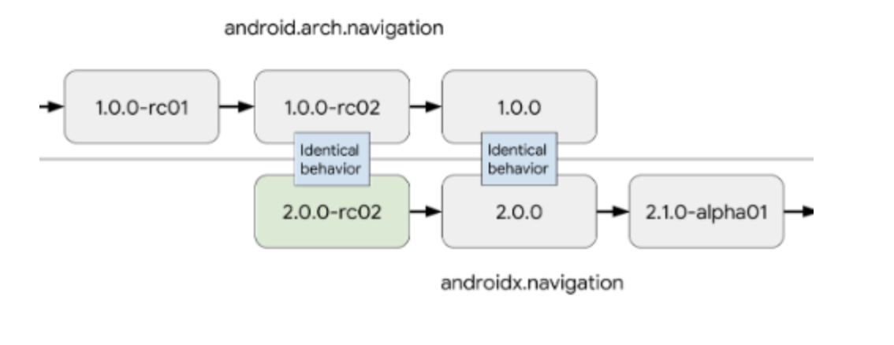

# 시작하기

### 참고 프로젝트
[안드로이드 네비게이션 코드랩](https://codelabs.developers.google.com/codelabs/android-navigation/#0) 을 참고 하였습니다.

### dependency 추가

버전에 따라 패키지 경로가 다르고, 2.0.0 대 버전 이상부터 androidX 를 지원하게 되었습니다.


androidX 기준 의존성 입니다.
```gradle
// app build.gradle
dependencies {
    implementation "androidx.navigation:navigation-fragment-ktx:$rootProject.navigationVersion"
    implementation "androidx.navigation:navigation-ui-ktx:$rootProject.navigationVersion"
}
```

SafeArgs 기능을 사용하려면 아래 코드도 추가해주어야 합니다.

```gradle
// project build.gradle
dependencies {
        classpath "android.arch.navigation:navigation-safe-args-gradle-plugin:$navigationVersion"
    //...
    }

// app build.gradle
apply plugin: 'androidx.navigation.safeargs'
```

