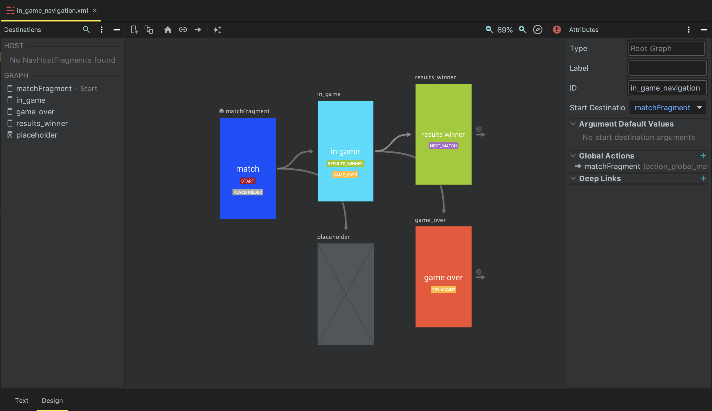

# Navigation Graph

### 정의
앱의 트랜잭션을 xml 코드로 구현합니다. design 탭에서 앱의 플로우를 볼 수 있습니다.



### 구현
`res/navigation/` 내부에 NavigationGraph 를 생성합니다.

```xml
<navigation xmlns:android="http://schemas.android.com/apk/res/android"
    xmlns:app="http://schemas.android.com/apk/res-auto"
    xmlns:tools="http://schemas.android.com/tools"
    app:startDestination="@+id/home_dest">

</navigation>    
```

* `app:startDestination` : 해당 네비게이션의 시작점을 지정합니다.
* `<fragment>`, `<dialog>` `<navigation>`, `<action>` 등의 태그를 사용하여 앱의 트랜잭션을 관리합니다.