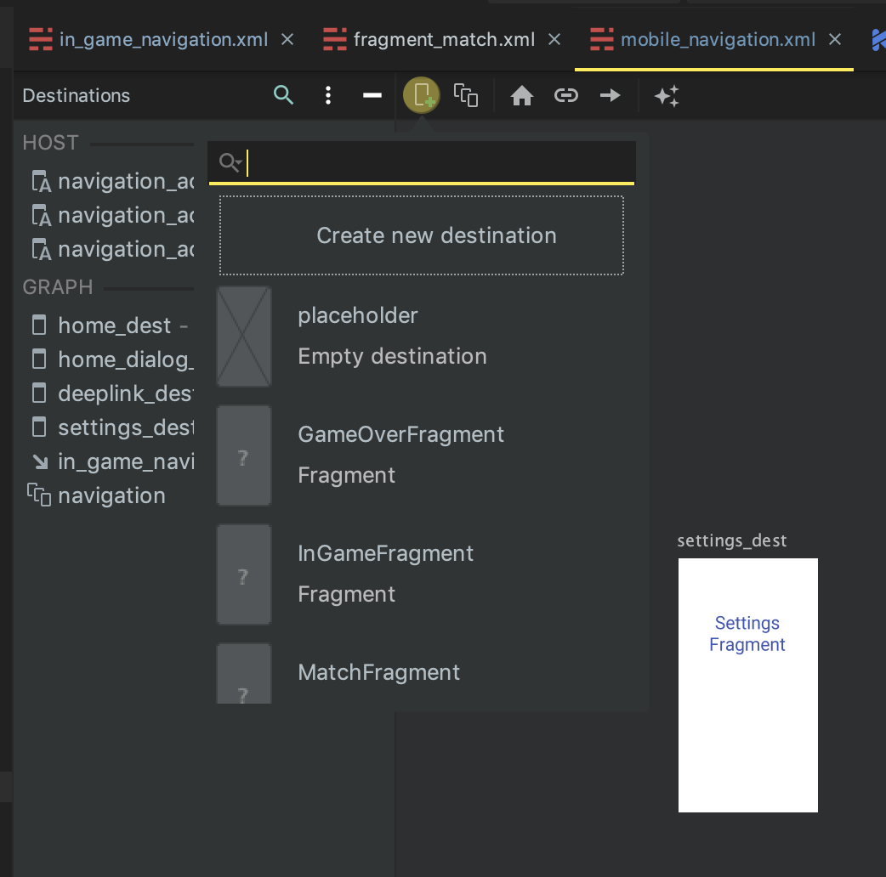

# Fragment
* `<navigation>` 태그 내부에서 사용되는 속성입니다.  
* 프래그먼트는 `<fragment>` 속성으로 정의 할 수 있습니다.
* `<fragment>` 태그 내부에는 `<action>`, `<argument>`, `<deepLink>` 태그 등이 들어갈 수 있습니다.

```xml
<fragment
    android:id="@+id/home_dest"
    android:name="com.example.android.codelabs.navigation.HomeFragment"
    android:label="@string/home"
    tools:layout="@layout/home_fragment">
</fragment>
```

`android:id` : navigation component 에서 해당 프래그먼트를 식별하는 키가 됩니다.  
`android:name` : fragment 를 지정합니다.  
`android:label` : 툴바의 제목을 지정합니다. 선언된 프래그먼트가 생성되면 지정된 라벨이 툴바에 표시 됩니다.  
`tools:layout` : design tab 에서 프래그먼트의 preview 를 보여주는 속성 입니다.

## design Tab
design Tab 에서 상단 버튼을 통해 navigation graph 에 위의 코드를 바로 넣어줄 수 있습니다.
