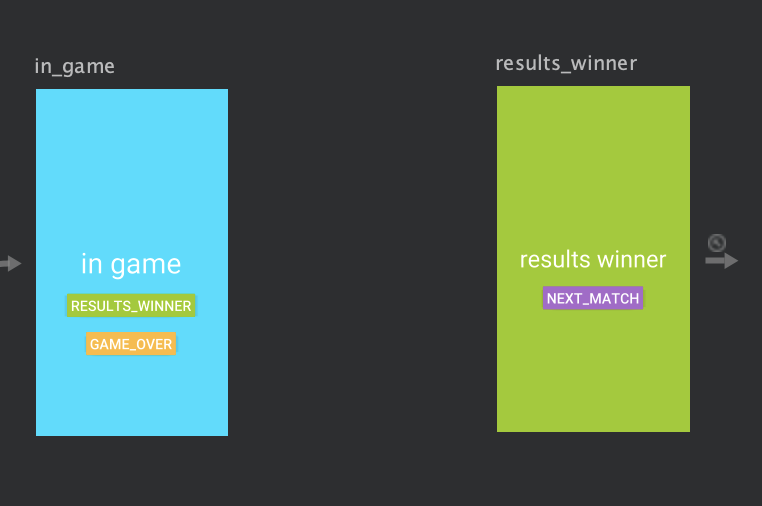
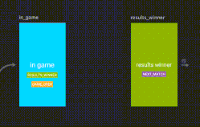
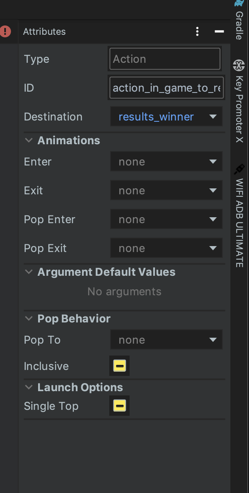

# Action

## 정의
프래그먼트 간의 이동 위치(목적지)를 정의합니다.

## 구현
### design tab
`in_game` 프래그먼트와 `results_winner` 프래그먼트가 있습니다.  
`in_game` 에서 `results_winner` 로 이동하려고 합니다.



프래그먼트 우측 테두리 중앙을 드래그하여 원하는 목적지에 끌어다 놓으면 destination 이 정의됩니다.



생성된 라인을 클릭하면 우측에 해당 action 의 속성들이 나타납니다.



### kotlin code

등록하기만 해서 동작이 되는 것은 아닙니다.  
원하는 시점에 정의해놓은 action 의 id 를 코드에서 호출해주어야 트랜잭션이 실행됩니다.  
4가지 방법이 있습니다.

```kotlin
// 1. default
NavHostFragment.findNavController(this).navigate(R.id.action_in_game_to_results_winner)

// 3. ktx    
findNavController().navigate(R.id.action_home_dest_to_home_dialog_dest)

// 2. View.onClickListener 반환
view.findViewById<View>(R.id.next_button)
    .setOnClickListener(
        Navigation.createNavigateOnClickListener(R.id.next_action)
    )

// 4. FragmentActions
val action = HomeFragmentDirections.nextAction()
findNavController().navigate(action)
```

`HomeFragmentDirections` 는 action 설정시 자동으로 생성되는 클래스 입니다.  
생성된 클래스에서 action 의 key 를 알고 있어서 메서드 호출로 전환이 가능합니다.

### xml code

```xml
<action
    android:id="@+id/action_in_game_to_results_winner"
    app:destination="@id/results_winner" 
    app:launchSingleTop="true" />
```

`android:id` : 해당 action 의 식별 키가 됩니다.  
`app:destination` : navigation graph 에 선언된 이동하려는 fragment 의 id 를 넣어주게 됩니다.
`app:launchSingleTop` : Activity 의 singleTop 과 같이 동작합니다.

```xml
<action
    android:id="@+id/action_results_winner_to_matchFragment"
    app:popUpTo="@+id/in_game_navigation" />  
```

`app:popUpTo` : 예를 들어 `A -> B -> C` 와 같이 스택이 쌓일 때 `C -> A` 로 바로 가고 싶다면   
                `popUpTo` 속성을 사용하여 중간 스택(`B`) 을 제거하고 바로 이동 할 수 있습니다.


